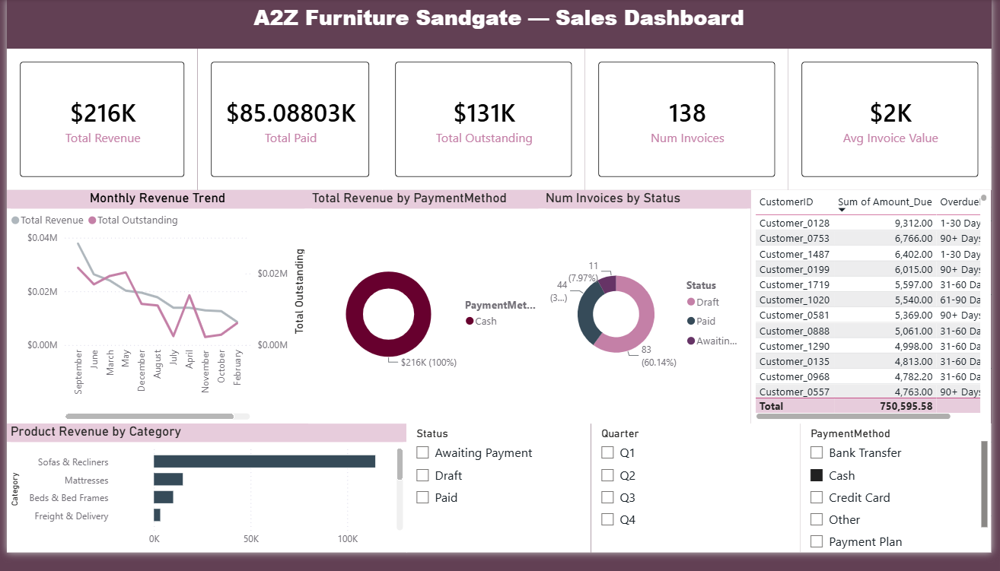

# A2Z Furniture Sandgate — Sales & Receivables Analytics Dashboard

A 3-page Power BI dashboard built from live Xero invoicing data for a furniture retail business, analysing 12 months of sales, payment collection, and product performance.



## Project Overview

This dashboard was built using real invoicing data exported from Xero for A2Z Furniture Sandgate, a furniture retailer. All customer names have been anonymised (e.g. `Customer_0001`) to protect privacy. The goal was to give the business owner visibility into revenue trends, outstanding payments, and which products drive the most sales.

## Key Metrics

| Metric | Value |
|---|---|
| Total Revenue (12 months) | $3,064,251 |
| Total Collected | $2,313,656 |
| Total Outstanding | $750,596 |
| Unique Invoices | 1,890 |
| Critical Overdue (90+ days) | $154,920 |

## Business Insights Delivered

- **Sofas & Recliners drive 70% of all revenue** — the business is heavily concentrated in one category, which is both a strength and a risk worth monitoring.
- **$154,920 (20% of all outstanding debt) is overdue by 90+ days** — flagged as the highest-priority collection target.
- **Split Payment is the most common payment method (42% of revenue)** — indicating many customers rely on instalment-style purchases for big-ticket furniture items.
- **The BOSTON electric recliner range (1/2/3 seater variants) is the single highest-earning product line**, generating $246,037 combined across the top 10 best sellers.
- **November is the peak sales month**, consistent with pre-Christmas furniture demand.

## Dashboard Pages

### Page 1 — Sales Overview
KPI cards (Revenue, Paid, Outstanding, Invoice Count, Avg Invoice Value), monthly revenue trend, payment method breakdown, invoice status breakdown, and category revenue ranking.

### Page 2 — Outstanding Payments
Aged receivables analysis with conditional formatting by overdue severity (1-30 / 31-60 / 61-90 / 90+ days), customer-level breakdown, and a critical overdue KPI to flag accounts needing urgent follow-up.

### Page 3 — Product Analysis
Top 10 best-selling products, revenue-by-category treemap, payment method performance, and monthly category trend lines.

## Data Model

Star-schema model with 6 tables connected via `InvoiceNumber`, `CustomerID`, `YearMonth`, and `Category`:

```
Customer_Summary (1) ──── Invoice_Summary (1) ──── Invoice_Line_Items (*)
                                  │                          │
                          Monthly_Revenue (1)        Category_Summary (1)
                                  
                  Aged_Receivables (*) ──── Customer_Summary (1)
```

## DAX Measures

See [`dax_measures/measures.dax`](dax_measures/measures.dax) for the full list. Key measures include:

```dax
Total Revenue = SUM(Invoice_Summary[Total])
Total Outstanding = SUM(Invoice_Summary[InvoiceAmountDue])
Collection Rate % = DIVIDE([Total Paid], [Total Revenue])
Critical Overdue 90+ = CALCULATE(SUM(Aged_Receivables[Amount_Due]), Aged_Receivables[OverdueBucket] = "90+ Days")
```

## Data Source & Privacy

Raw data was exported from Xero (Sales → Invoices → Export) covering June 2025 to June 2026. Before any analysis or upload, all customer names were anonymised and replaced with sequential IDs (`Customer_0001`, `Customer_0002`, etc). No email addresses, phone numbers, or addresses are included in the dataset.

## Tools Used

- **Power BI Desktop** — data modelling, DAX, visualisation
- **Power Query** — data cleaning and transformation
- **Python (pandas)** — combining and anonymising raw CSV exports
- **Xero** — original data source

## Screenshots

| Page | Preview |
|---|---|
| Sales Dashboard | `screenshots/page1_sales_dashboard.png` |
| Outstanding Payments | `screenshots/page2_outstanding_payments.png` |
| Product Analysis | `screenshots/page3_product_analysis.png` |

---

*Built by Elanagai Arivuchelvan — Final Year Software Engineering Student, University of Queensland*
